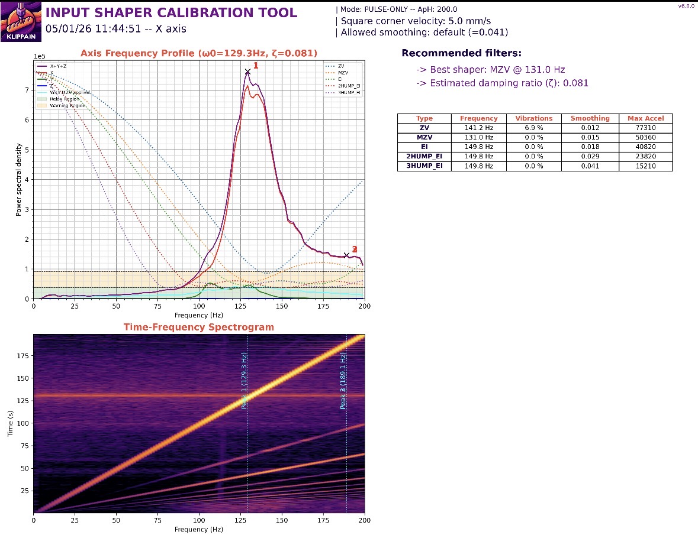
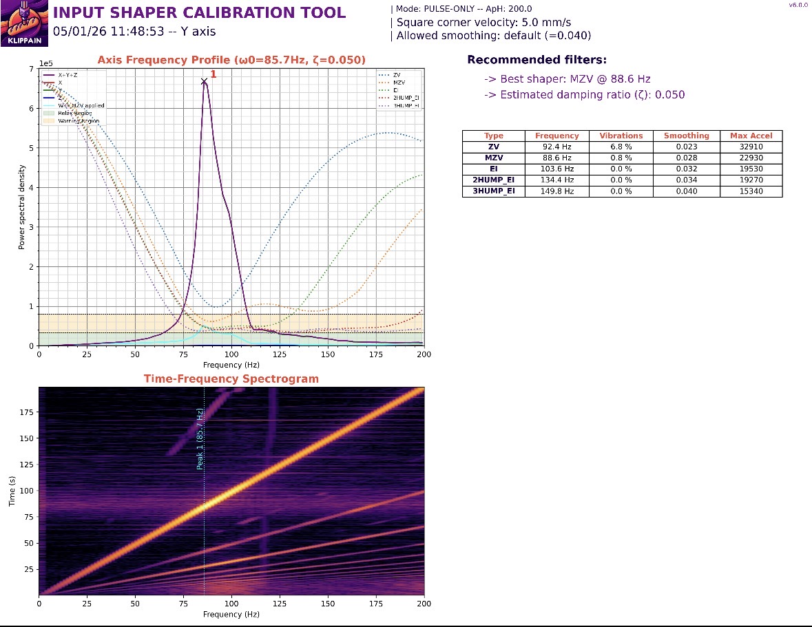
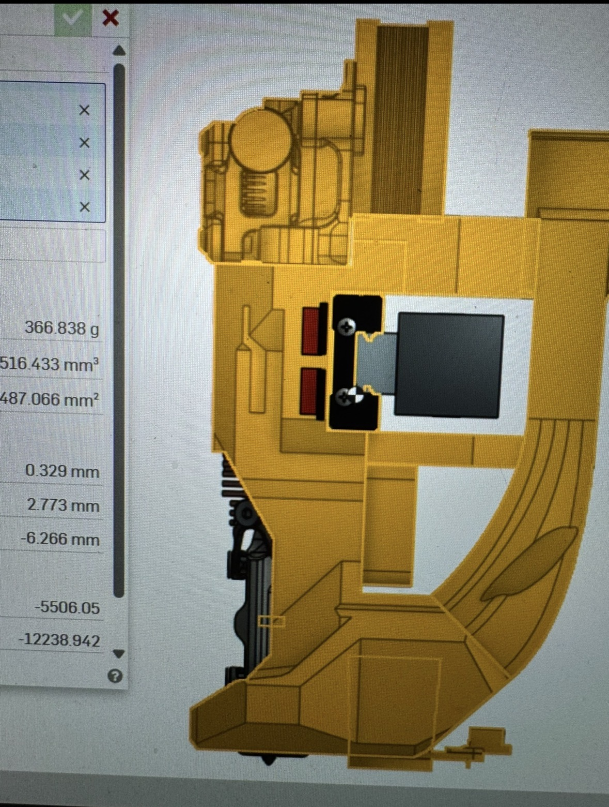

# Sphinx Toolhead

**File repository for the Sphinx toolhead**

Sphinx toolhead is aimed to be a high-performance toolhead with an emphasis on part cooling and rigidity.  
This project was built around the goal of printing a **quality 4-minute PLA Benchy**.  

This toolhead has different configurations for Monolith gantry and Voron gantry.

This project is a **work in progress!**

If you use this toolhead and modify or remix, please upload here or reach out and let me know on Instagram or Discord!  
📸 Instagram: [@practically_printed](https://instagram.com/practically_printed)  
💬 Discord: https://discord.gg/PdSYQn8kq

---

## 🧩 Notes

The current and most up to date version of Sphinx is called Sphinx tLW. This version utilizes a micro bowden approach in order to optimize for COM while not compromising on toolhead rigidity and so far has proved to work very well. 

- **Print Settings:** 8 walls, 8 top/bottom layers, 40% infill

---

## 📸 Pictures (These are Out of Date)

---

## 📈 Input Shaper Results

| X IS Graph | Y IS Graph |
|:-----------:|:----------:|
|  |  |

---

## ⚙️ Mass Specs / COM

 

 Center of mass is left lower to account for un measured wires and CPAP hose mass

 
---

## 🧰 Currently Supported Hardware

**Hotends:**  
- Tricorn
- Goliath
- CHC XL
- Rapido UHF
- Dragon UHF

**Extruders:**  
- Sherpa Mini  

**Probes:**  
- Beacon
- Cartographer

---

## 🔧 Hardware in Progress

**Hotends:**    
- Chube Compact    

**Extruders:**  
- Orbiter 2.0 (maybe)   
  

---

## 🌬️ Cooling Capability

The toolhead is built specifically around the duct geometry to maximize usable airflow for part cooling, with support for either WS9290 or WS7040 blowers. The 9290 blower is the optimal option is very aggressive and great for speed printing, but the 7040 duct will not disappoint. The goal of the ducts was to be able to print a perfect 5min benchy. Below is some data I collected that I used to optimize the toolhead ducts for both blowers.

## 5min 20sec PLA Benchy

---

## Other Information

Sphinx is meant to be used with an mgn12H rail carriage. I higher preload x rail is encouraged for best Input Shaper results 

COM for this toolhead was optimized using CNC Sherpa Mini and Tricorn, but will also be should be pretty similar with all other hotends

Tested successfully with **Siraya Tech ABS-CF**, though any filled abs or better is recommended.

---

*© Sphinx Toolhead Project – Open-source and community-driven.*
