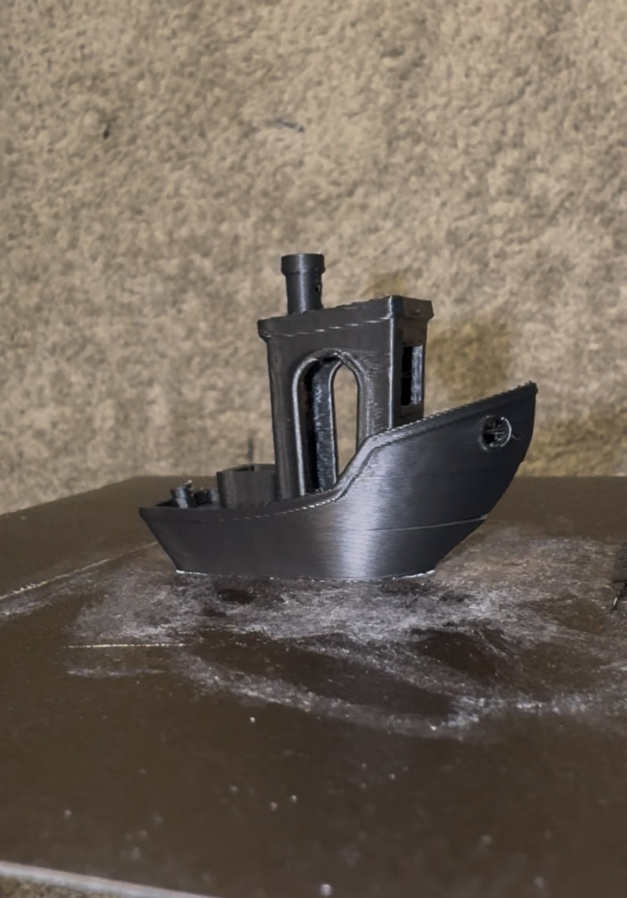

# Sphinx Toolhead

**File repository for the Sphinx toolhead**

Sphinx toolhead is aimed to be a high-performance toolhead with an emphasis on part cooling and rigidity.  
This project was built around the goal of printing a **quality 4-minute PLA Benchy**.  

Sphinx is a **work in progress!** If you have any suggested feel free to reach out of discord!

If you use this toolhead and modify or remix, please upload here or let me know on Instagram or Discord!  
📸 Instagram: [@practically_printed](https://instagram.com/practically_printed)  
💬 Sphinx Development Channel: https://discord.gg/PdSYQn8kq

---

## 📁 Repository Structure

The repository is organized into the following main directories:

- **[CAD/](CAD/)**: Contains all STEP files for the toolhead, organized by version and hardware variant.
  - **[V3-Beta/](CAD/V3-Beta/)**: The latest beta version (V3). Highly optimized for part cooling and performance.
    - Includes variants for **Tricorn**, **Goliath**, **CHC XL**, and **Rapido UHF** hotends.
    - Supports both **WS7040** and **WS9290** blowers.
  - **[V2-Stable/](CAD/V2-Stable/)**: The current stable version.
  - **[Accessories/](CAD/Accessories/)**: Universal parts like CPAP clamps and miscellaneous mounts.
- **[Images/](Images/)**: Photos, diagrams, and time-lapse videos of the toolhead in action.
- **[STLs/](STLs/)**: Placeholder for future STL exports.

---

## 🛠️ Sphinx Toolhead Configurator

We now provide an interactive 3D configurator to help you select the right parts for your specific hardware setup:

- **[Launch Configurator (Beta)](Configurator/configurator.html)**

The configurator allows you to select your Version, Hotend, Extruder, Blower, and Rail type to visualize the assembly and ensure you download the correct parts from the `CAD/` directory.

---

## 🧩 Notes

The current and most up to date version of Sphinx is called Sphinx tLW. This version utilizes a micro bowden approach in order to optimize for COM while not compromising on toolhead rigidity and so far has proved to work very well. 

- **Print Settings:** 8 walls, 8 top/bottom layers, 40% infill
- Print at least 4 of the Apex clips in either the Voron or Monolith folder

---

## 📸 Pictures (Outdated Pictures of Gen1 Sphinx)

---

## 📈 Input Shaper Results

| X IS Graph | Y IS Graph |
|:-----------:|:----------:|
|  |  |

---

## ⚙️ Mass Specs / COM

 

 Center of mass is left lower to account for un measured wires and CPAP hose mass

 
---

## 🧰 Currently Supported Hardware

**Hotends:**  
- Tricorn
- Goliath
- CHC XL
- Rapido UHF
- Dragon UHF

**Extruders:**  
- Sherpa Mini  

**Probes:**  
- Beacon
- Cartographer

---

## 🔧 Hardware in Progress

**Hotends:**    
- Chube Compact    

**Extruders:**  
- Orbiter 2.0 (maybe)   
  

---

## 🌬️ Cooling Capability

The toolhead is built specifically around the duct geometry to maximize usable airflow for part cooling, with support for either WS9290 or WS7040 blowers. The 9290 blower is the optimal option is very aggressive and great for speed printing, but the 7040 duct will not disappoint. The goal of the ducts was to be able to print a perfect 5min benchy. 

## 5min 20sec ABS Benchy

---

## Other Information

Sphinx is meant to be used with an mgn12H rail carriage. I higher preload x rail is encouraged for best Input Shaper results 

COM for this toolhead was optimized using CNC Sherpa Mini and Tricorn, but will also be should be pretty similar with all other hotends

Tested successfully with **Siraya Tech ABS-CF**, though any filled abs or better is recommended.

---

## Acknowledgements

Apex clips: https://github.com/ApexArray/ApexClips

Huge shout out to everyone in the Excit3d discord for helping me test and develop this toolhead! Couldn't have done it without their help

*© Sphinx Toolhead Project – Open-source and community-driven.*
